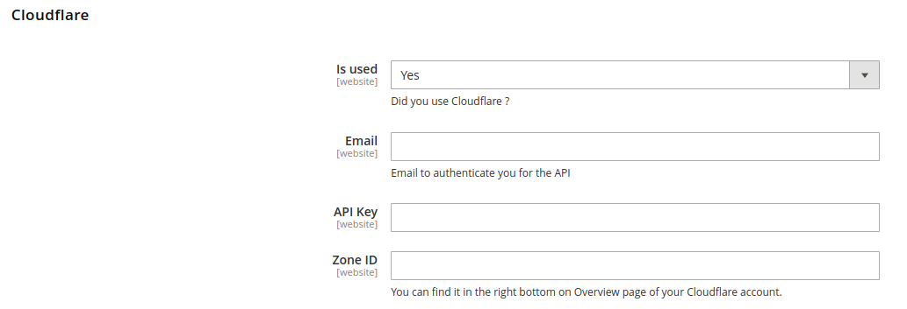

<!-- markdownlint-configure-file {
  "MD013": {
    "code_blocks": false,
    "tables": false
  },
  "MD033": false,
  "MD041": false
} -->

<div align="center">

# magento-2-clean-cloudflare-image-cache

[](https://packagist.org/packages/blackbird/magento-2-clean-cloudflare-image-cache)
[](./LICENSE)

This module depend on [blackbird/magento-2-clean-product-image-cache](https://github.com/blackbird-agency/magento-2-product-clean-image-cache) 

**Problem** : if changed images url is cached by Cloudflare, you need to purge manually these URLs in Cloudflare to see the new image.

**Solution** : this module which clean product image cached by Cloudflare.

[How It Works](#how-it-works) •
[Installation](#installation) •
[Configuration](#configuration) •
[Support](#support) •
[Contact](#contact) •
[License](#license)

</div>

## How It Works

When you save a product in the back-office it will call Cloudflare API to purge image URL cache.

## Installation

```
composer require blackbird/magento-2-clean-cloudflare-image-cache
```
```
php bin/magento setup:upgrade
```
*In production mode, do not forget to recompile and redeploy the static resources.*

## Configuration

In the Back-Office in **System** > **Configuration** > **Blackbird** > **Clean Image Cache** > **Cloudflare** : 



- **Email** : mail use for your Cloudflare account 
- **API Key** : can be find here https://dash.cloudflare.com/profile/api-tokens
- **Zone ID** : visible in the **Overview** page in API Section https://developers.cloudflare.com/fundamentals/setup/find-account-and-zone-ids/

After that you just need to clean you Config cache and all is done !

## Support

- If you have any issue with this code, feel free to [open an issue](https://github.com/blackbird-agency/magento-2-clean-cloudflare-image-cache/issues/new).
- If you want to contribute to this project, feel free to [create a pull request](https://github.com/blackbird-agency/magento-2-clean-cloudflare-image-cache/compare).

## Contact

For further information, contact us:

- by email: hello@bird.eu
- or by form: [https://black.bird.eu/en/contacts/](https://black.bird.eu/contacts/)

## License

This project is licensed under the MIT License - see the [LICENSE](./LICENSE) file for details.

***That's all folks !***